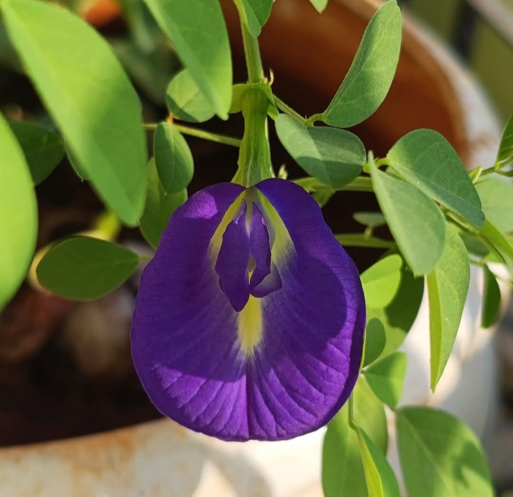

  

<h1 align="center">🍽️ Parvati Singh Foods</h1>

Simple • Healthy • Homemade Indian Recipes ❤️

---

# 🌿 About

Desi food, simple moments & daily life 😍 | Homemade recipes 🍲 | Positive vibes | Parvati Singh Foods✨

Welcome to *Parvati Singh Foods*.
Parvati Singh Foods is a food brand dedicated to sharing simple, healthy, delicious and homemade Indian recipes. Our mission is to inspire families to cook tasty meals at home using everyday ingredients while promoting healthy eating, zero oil cooking, vegetarian recipes, traditional Indian recipes and positive lifestyle content.
Whether you're looking for breakfast ideas, lunch recipes, dinner recipes, snacks, sweets or festival special recipes, Parvati Singh Foods brings easy step-by-step recipes for everyone.

---

# ❤️ Our Mission

✔️ Healthy Homemade Food
✔️ Zero Oil Cooking
✔️ Indian Traditional Recipes
✔️ Vegetarian Recipes
✔️ Easy Recipes For Everyone
✔️ Positive Food Journey

---

# 🍛 What You'll Find
* Homemade Indian Recipes
* Zero Oil Cooking Recipes
* Healthy Breakfast Recipes
* Healthy Lunch Recipes
* Healthy Dinner Recipes
* High Protein Recipes
* Paneer Recipes
* South Indian Recipes
* Village Style Recipes
* Traditional Indian Food
* Vegetarian Recipes
* Snacks Recipes
* Sweet Recipes
* Festival Special Recipes
* Daily Food Videos
* Cooking Tips
  
---

# 🌐 Official Profiles

▶️ YouTube
https://www.youtube.com/@parvatisinghfoods

📘 Facebook
https://www.facebook.com/parvatisinghfoods

📷 Instagram
https://www.instagram.com/parvatisinghfoods

📌 Pinterest
https://pinterest.com/parvatisinghfoods

💼 LinkedIn
https://www.linkedin.com/company/parvatisinghfoods

🎬Dailymotion
https://www.dailymotion.com/parvatisinghfoods

📝 Medium
https://medium.com/@parvatisinghfoods

@ Threads
https://www.threads.com/@parvatisinghfoods

❓ Quora
https://www.quora.com/Parvati-Singh-Foods

🎨 Tumblr
https://www.tumblr.com/parvatisinghfoods

🌍 About.me
https://about.me/parvatisinghfoods

🔗 Linktree
https://linktr.ee/parvatisinghfoods

❎ X
https://x.com/Parvatifoodz

---

# 🔥 Brand Keywords

Parvati Singh Foods
Parvati Singh Recipes
Homemade Indian Recipes
Healthy Recipes
Healthy Indian Food
Zero Oil Cooking
Zero Oil Recipes
Indian Recipes
Traditional Indian Food
Village Cooking
Healthy Breakfast Recipes
Healthy Lunch Recipes
Healthy Dinner Recipes
High Protein Recipes
Paneer Recipes
Vegetarian Recipes
Homemade Food
Easy Recipes
Indian Cooking
Food Blogger
Food Creator
Food Influencer
Indian Food Creator
Home Chef
Daily Food Videos
Positive Food Content
Mumbai Food Creator

---

# ⭐ Follow Our Journey

Thank you for supporting *Parvati Singh Foods*.
Stay connected with us across all social media platforms for delicious homemade recipes, healthy cooking inspiration and daily food videos.

---

# ❤️ Made With Love
*Parvati Singh Foods*

📍 Mumbai, India

"Simple Food • Healthy Life • Homemade Happiness"
